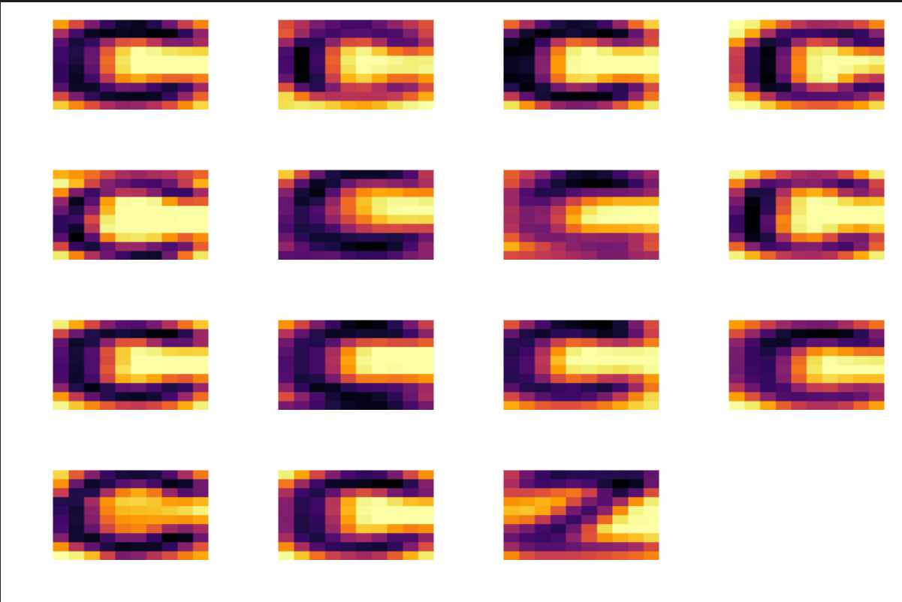

# FinalProject

## Project Installation

The package can be installed with the following command
```julia
(@v1.8) pkg> add https://github.com/B0B36JUL-FinalProjects-2022/Projekt_korladia.git
```
Note: The project name is FinalProject (differs from the repository name).


## Task
Optical character recognition - binary classification of images, in this case of two letters which can be chosen from the available alphabet. A feature will be extracted from each image (data preprocessing) and used in two different classification frameworks in order to decide its label. The dataset will be split into training and testing parts.

## Data
A dataset containing 20 letters as 10 x 10 pixel image chips (30 images per letter).
<p align="left">
 
</p>

## Classification Methods
- Logistic Regression - a generative classification approach interpreted as an optimization task
- Kozinec’s Algorithm - a discriminative classification approach (produces a dividing hyperplane)

## Result
- Labels for each image 
- Classification error (when compared to the actual labels) 
- Image representation of the classification
<p align="left">
 
</p>

## Inseparable data
Oftentimes the data cannot be separated by a linear decdision boundary. To create a nonlinear decision hyperplane a nonlinear transformation of the observed data needs to be computed and then used in the linear regression model instead of the original data.
<p align="left">
 
</p>

## Multivariate Perceptron
With some altercations to the algorithm, the perceptron can handle multi-class data classification.
<p align="left">
 
</p>